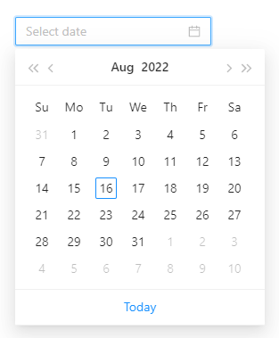

<p align="center">
	</img>
</p>
<h1 align="center">feffery-antd-components</h1>
<div align="center">

[](https://github.com/CNFeffery/feffery-antd-components/blob/master/LICENSE)
[](https://pypi.org/project/feffery-antd-components/)
[](https://pepy.tech/project/feffery-antd-components)
[](https://pepy.tech/project/feffery-antd-components)
[](https://pepy.tech/project/feffery-antd-components)

</div>

> Version `0.2.0` will be released soon, so stay tuned

[简体中文](./README.md) | English

Subproject of `feffery-components` projects, third-party components library of `Plotly Dash`, based on the [Antd](https://github.com/ant-design/ant-design), brings many common and powerful components into `Dash`🥳, latest stable version: `0.1.16`, latest preview version: `0.2.0rc25`

## 1 Install

```bash
pip install feffery-antd-components -U
```

## 2 Install from GitHub

```bash

pip install git+https://github.com/CNFeffery/feffery-antd-components.git
```

## 3 Use CDN

```Python
# just set serve_locally=False in dash.Dash()
app = dash.Dash(serve_locally=False)
```

## 4 Documentation

<a href='http://fac.feffery.tech/' target='_blank'>fac.feffery.tech</a>

## 5 Internationalization

The default language of `fac` is currently simplified Chinese. If you wish to use English, just set `locale='en-us'`, for example：

```Python
fac.AntdDatePicker(locale='en-us')
```

</img>
